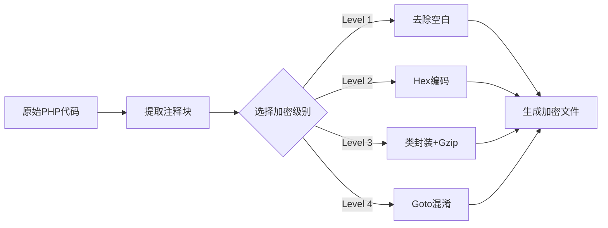

# 🔐 PHP 组件批量加密工具 (Component Batch Encryptor)

[](LICENSE)
[](https://www.python.org/)
[](https://github.com)

> **声达网络 (sdczz.com)** 专为 WordPress 插件、Composer 包、框架扩展设计  
> 保留代码结构，低误报风险，专业的组件级混淆方案

---

## ✨ 成品下载链接
https://pan.quark.cn/s/28e2b1b3b243

声达多应用授权php程序

https://www.sdczz.com/downloads/shengdaphpsq

## ✨ 项目特色

- 📦 **组件化封装**：保留 `class`、`namespace` 结构，适配自动加载 (Autoload)
- 🎨 **专业外观**：加密后看起来像正规的开源库，不会被误认为恶意代码
- 🛡️ **低误报率**：避免宝塔、安全狗等防火墙拦截
- 🔧 **四级混淆**：从基础清理到流程控制打乱
- 🚀 **框架友好**：完美兼容 WordPress、Laravel、ThinkPHP 等主流框架
- 💼 **商业适用**：适合插件开发者、外包团队保护知识产权
- 🛡️这两个项目可以考虑搭配使用
- 🛡️https://github.com/xielaoban-pro/Component-Batch-Encryptor
- 🛡️https://github.com/xielaoban-pro/PHP-Batch-Obfuscator

---

## 📋 加密级别详解

### Level 1: Clean (基础清理)
```php
// 输出效果
<?php
namespace MyPlugin;
class Component {
    public static function run() {
        // 去除所有注释、换行、缩进
        $data=base64_decode('...');eval($data);
    }
}
```
- **特点**：保留结构，清理冗余
- **安全性**：⭐⭐
- **适用**：开源项目轻度混淆

---

### Level 2: Hex (中级混淆)
```php
// 输出效果
<?php
namespace MyPlugin;
class Component {
    public static function exe() {
        $x="\x24\x63\x6f\x64\x65...";  // Hex 编码
        eval($x);
    }
}
```
- **特点**：Shell 风格 Hex 编码
- **安全性**：⭐⭐⭐
- **适用**：API 接口、授权验证模块

---

### Level 3: Class (高级组件) ⭐ 推荐
```php
// 输出效果
<?php
/**
 * Component_XYZ
 * @version 1.0.0
 */
class Component_A7f2d9 {
    private static $payload = "H4sIAAAAAAAA...";
    
    public static function init() {
        $code = gzuncompress(base64_decode(self::$payload));
        eval($code);
    }
}
Component_A7f2d9::init();
```
- **特点**：封装为标准类，静态调用
- **安全性**：⭐⭐⭐⭐
- **适用**：WordPress 插件、Composer 包

---

### Level 4: Goto (流程混淆) 🔥 最强
```php
// 输出效果 (模拟 YAK Pro-Po 风格)
<?php
goto _L1;
_L3: $result = $a + $b; goto _L5;
_L1: $a = 10; goto _L3;
_L5: echo $result; goto _END;
_END:
```
- **特点**：打乱执行顺序，增加逆向难度
- **安全性**：⭐⭐⭐⭐⭐
- **适用**：高价值商业插件、核心算法

---

## 🚀 快速开始

### 环境要求
```bash
Python 3.7+
目标服务器 PHP 5.4+ (支持 namespace、静态方法)
```

### 安装使用

#### 方式一：直接运行
```bash
# 双击启动交互式界面
cd zujianphpjiami
python component_encryptor.py
```

#### 方式二：命令行模式
```bash
# 加密单个文件
python component_encryptor.py MyClass.php -o MyClass_protected.php -m 3

# 加密整个插件目录
python component_encryptor.py ./my-plugin -o ./my-plugin-encrypted -m 3

# 保留原注释
python component_encryptor.py input.php -o output.php -m 3 --keep-comments
```

### 交互式操作

```bash
$ python component_encryptor.py

==========================================
      声达网络 PHP 组件加密工具 (Component Ed.)
      基于 GitHub 开源混淆逻辑架构
==========================================

[?] 拖入文件或目录: ./wp-content/plugins/my-plugin
[?] 输出路径: ./encrypted-plugin
[?] 选择加密级别:
  1. Clean  [基础] - 仅清理注释空格
  2. Hex    [中级] - Hex 编码混淆
  3. Class  [高级] - 类组件封装 ⭐ 推荐
  4. Goto   [混淆] - 流程控制打乱 🔥 最强

输入序号 (1-4, 默认 3): 3
[?] 保留原注释 (y/N): n

✅ 处理完成！
```

---

## 🎯 使用场景

### ✅ 推荐场景

| 场景 | 推荐级别 | 说明 |
|------|---------|------|
| 🛒 WordPress 付费插件 | Level 3 | 保留类结构，防火墙友好 |
| 📦 Composer 私有包 | Level 3 | 支持 PSR-4 自动加载 |
| 🔐 授权验证模块 | Level 4 | 高安全性要求 |
| 🎨 主题模板 | Level 2 | 轻度混淆，保持可读性 |
| 🔌 第三方 API SDK | Level 3 | 专业外观，易于集成 |

### ❌ 不适用场景

- ❌ 需要客户二次开发的代码
- ❌ 开源项目（违反协议）
- ❌ 高频调用的性能敏感代码

---

## 📊 对比分析

### 本工具 vs 传统整站加密

| 特性 | 组件加密工具 | 传统整站混淆 |
|------|-------------|-------------|
| **外观** | 规范的类结构 | 一坨乱码 |
| **防火墙风险** | ✅ 低 | ⚠️ 高（易误报） |
| **框架兼容性** | ✅ 完美支持 | ⚠️ 需要测试 |
| **逆向难度** | ⭐⭐⭐⭐ | ⭐⭐⭐⭐⭐ |
| **适用范围** | 插件/扩展 | 整站源码 |
| **客户接受度** | ✅ 高 | ⚠️ 中 |

---

## 🧪 加密示例

### 原始代码
```php
<?php
namespace MyPlugin\Core;

class PaymentGateway {
    private $secret_key = "sk_live_abc123";
    
    public function charge($amount) {
        // 核心支付逻辑
        return $this->api_call($amount);
    }
}
```

### Level 3 加密后
```php
<?php
/**
 * Component_Payment
 * Protected by SDCZZ Component Encryptor
 */
class Component_Bc8e4f {
    private static $data = "H4sIAAAAAAAAA+1WTW/bMAy9+1cEPmwHBP...";
    
    public static function decrypt() {
        $raw = base64_decode(self::$data);
        $code = gzuncompress($raw);
        eval($code);
    }
}
Component_Bc8e4f::decrypt();
```

---

## 🏗️ 构建可执行文件

```bash
# 安装依赖
pip install pyinstaller

# 使用提供的 spec 文件构建
pyinstaller sdczz_component_v2.spec

# 输出文件
dist/component_encryptor.exe
```

---

## 🔍 WordPress 插件加密示例

### 加密整个插件
```bash
# 原始插件目录
wp-content/plugins/my-shop/
├── my-shop.php          # 主文件
├── includes/
│   ├── class-cart.php
│   └── class-payment.php
└── readme.txt

# 加密命令
python component_encryptor.py wp-content/plugins/my-shop -o my-shop-encrypted -m 3

# 加密后
my-shop-encrypted/
├── my-shop.php          # 已加密
├── includes/
│   ├── class-cart.php   # 已加密
│   └── class-payment.php # 已加密
└── readme.txt           # 自动跳过非.php文件
```

---

## ⚙️ 配置文件

工具会自动保存配置到 `component_config.json`：

```json
{
    "last_output_dir": "D:\\workspace\\encrypted",
    "default_mode": "3"
}
```

---

## ⚠️ 注意事项

### ✅ 优势
- ✔️ 适配 WordPress/Laravel/ThinkPHP 框架
- ✔️ 支持 PSR-4、Composer autoload
- ✔️ 防火墙友好，低误报
- ✔️ 保留代码的"专业感"

### ⚠️ 限制
- ⚠️ Level 4 (Goto) 模式可能影响调试
- ⚠️ 不支持动态 `include` 路径加密
- ⚠️ 需要目标服务器支持 `eval()`

### 🔐 安全建议
建议结合以下措施：
1. 服务端授权验证
2. 域名绑定检测
3. 定期更新加密版本

---

## 🛠️ 技术原理



---

## 📝 开源协议

本项目采用 MIT 协议开源。

**版权所有 © 2026 声达网络 (sdczz.com)**

---

## 🤝 贡献指南

欢迎提交改进建议！

1. Fork 本仓库
2. 创建特性分支
3. 提交 Pull Request

---

## 💡 常见问题

**Q: 加密后能在 PHP 8.x 运行吗？**  
A: 可以。所有级别均兼容 PHP 5.4 - 8.3。

**Q: 会被宝塔防火墙拦截吗？**  
A: Level 3/4 模式经过优化，极少误报。Ultra 模式按需使用。

**Q: 支持加密 Composer 包吗？**  
A: 支持。使用 Level 3 保留 PSR-4 结构。

**Q: 能防止所有逆向破解吗？**  
A: 无法100%防护，但能大幅提高破解成本。建议结合授权系统。

---

## 📧 联系方式

- 🌐 官网：[sdczz.com](https://sdczz.com)
- 💬 问题反馈：提交 GitHub Issue
-  声达多应用授权php程序
   https://www.sdczz.com/downloads/shengdaphpsq

---

## ⭐ Star History

如果这个项目帮助了您，请给我们一个 ⭐！您的支持是我们持续更新的动力。

---

**免责声明**：本工具仅用于合法的软件知识产权保护，使用者需遵守当地法律法规。
